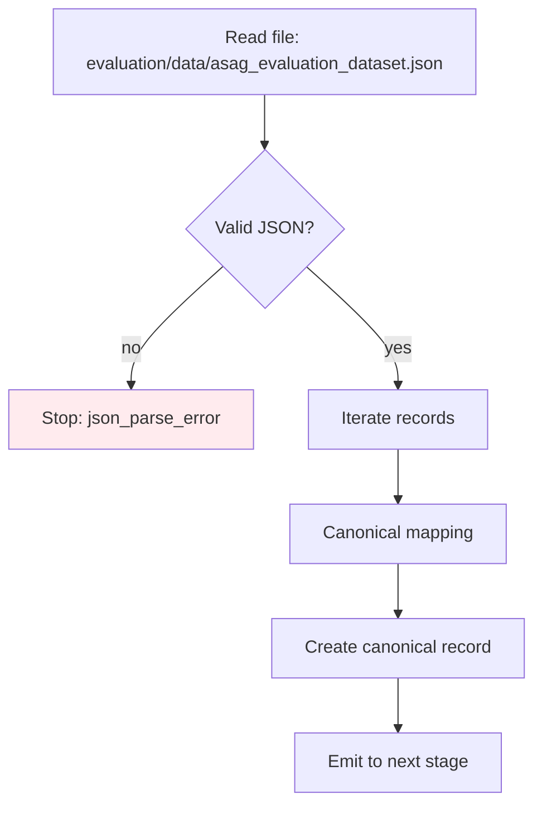
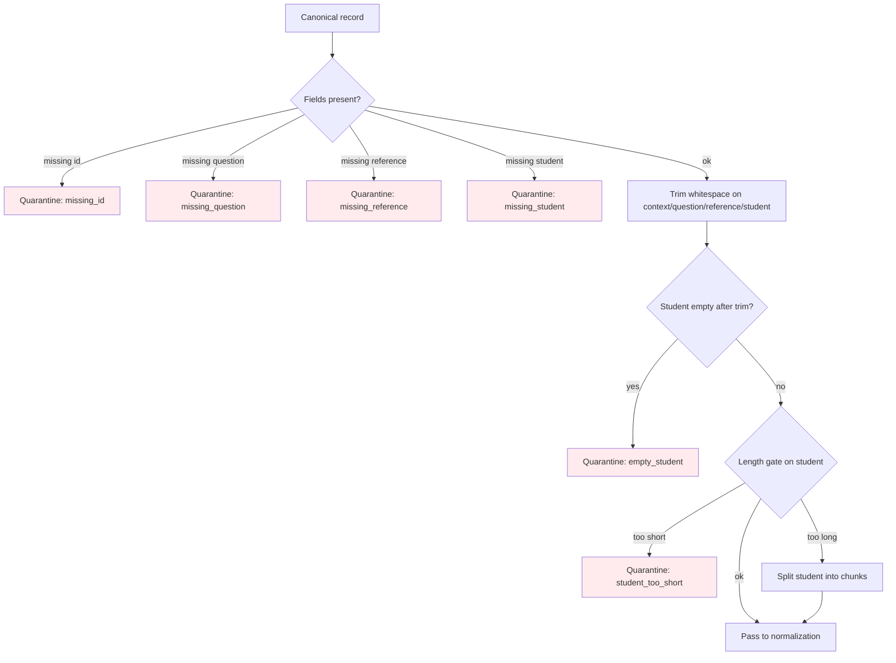
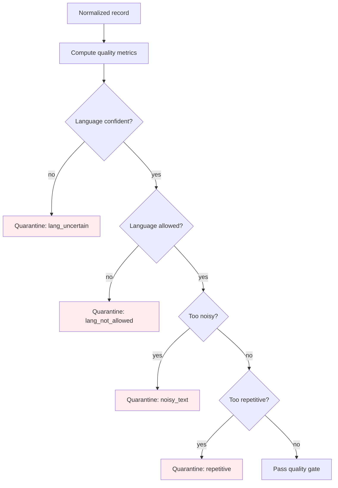
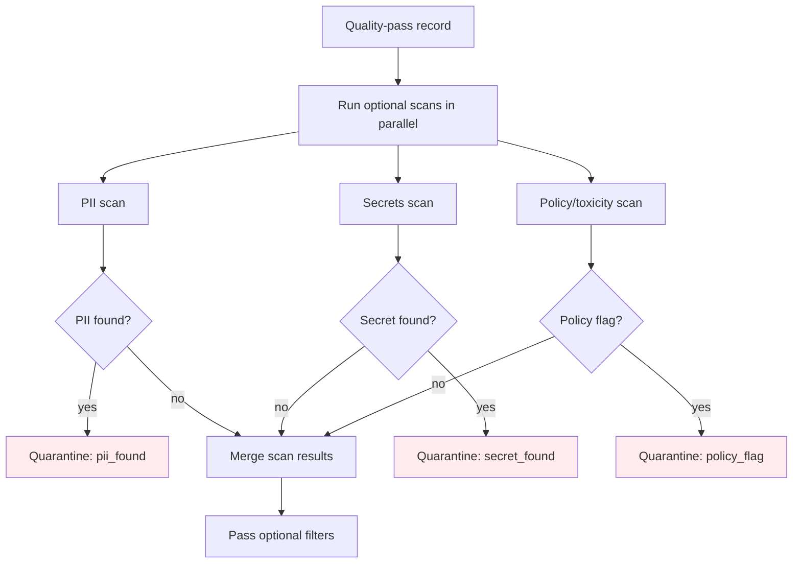

# DATA PREP KIT (TEXT-ONLY) — INPUT DATA PREPROCESSING PIPELINE (PROJECT-FIT)

Tài liệu này mô tả **pipeline preprocessing dữ liệu text thuần theo đúng dữ liệu của dự án**, khớp với:
- Input dataset: `evaluation/data/asag_evaluation_dataset.json`
- Output dự kiến sau khi chấm: `grading_results.json` (format `GradingResult`)

Mục tiêu: biến mỗi record dataset thành **GradeRequest-compatible record**:
`{context, question, reference, student}` + giữ metadata để evaluation (`id`, `gold_label`, `gold_score`).

---

## FIGURE A — TỔNG QUAN DATA PREP KIT (DỮ LIỆU DỰ ÁN)

```mermaid
flowchart TD
    A0[Load evaluation/data/asag_evaluation_dataset.json] --> A1[Parse JSON array records]
    A1 --> A2[Schema validation + canonical mapping]
    A2 -->|pass| A3[Text normalization]
    A2 -->|fail| A2E[Quarantine record (reason_tag)]

    A3 --> A4[Quality gates]
    A4 -->|pass| A5[Dedup / near-dup]
    A4 -->|fail| A4E[Quarantine record (quality_tag)]

    A5 --> A6[Split (train/val/test) for evaluation]
    A6 --> A7[Write dataset artifacts]
    A7 --> A8[Run grader -> grading_results.json]

    style A2E fill:#ffebee
    style A4E fill:#ffebee
```

**Field mapping theo dữ án**:
- Input record:
    - `id`
    - `context`
    - `question`
    - `reference_answer`
    - `student_answer`
    - `gold_label` (phục vụ evaluation)
    - `gold_score` (phục vụ evaluation)
- GradeRequest (đưa vào grader/API):
    - `context` (giữ nguyên)
    - `question` (giữ nguyên)
    - `reference` = `reference_answer`
    - `student` = `student_answer`

---

## FIGURE B — LOAD + CANONICAL MAPPING (CHI TIẾT)



**Canonical record (khớp dự án + thuận tiện grading/evaluation)**:
```json
{
    "id": "syn_0412",
    "context": "...",
    "question": "...",
    "reference": "...",
    "student": "...",
    "gold": {
        "label": "correct|partially_correct_incomplete|contradictory|irrelevant|non_domain",
        "score": 0.0
    }
}
```

**Mapping rule**:
- `reference = reference_answer`
- `student = student_answer`

---

## FIGURE C — SCHEMA/FIELD VALIDATION + QUARANTINE LOGIC (DỰ ÁN)



**Thresholds gợi ý (bám theo logic grader hiện tại)**:
- `min_words_student`: 1 cho “giữ record”, nhưng **< 3** sẽ vào chế độ “short answer” ở grader.
- `min_words_for_full_analysis`: 3 (đúng như grader).
- `max_chars_student`: 2000–4000 để tránh prompt quá dài (tuỳ bạn).
- `split_policy`: split theo câu/đoạn, tạo `id = original_id + "#chunk_k"`.

---

## FIGURE D — TEXT NORMALIZATION (text thuần, phù hợp dataset)

```mermaid
flowchart TD
    D0[Validated record] --> D1[Unicode normalize (NFKC)]
    D1 --> D2[Normalize whitespace]
    D2 --> D3[Normalize punctuation]
    D3 --> D4[Remove control characters]
    D4 --> D5[Finalize normalized fields]
    D5 --> D6[Output normalized record]
```

**Lưu ý**:
- Với tiếng Việt: nên **giữ dấu** và hạn chế “lowercase all” nếu downstream cần giữ proper noun.
- OCR-fix là optional (chỉ bật nếu nguồn OCR).

---

## FIGURE E — QUALITY GATES (dành cho dataset evaluation)



**Quality metrics gợi ý**:
- `τ_lang`: 0.70–0.90
- `τ_noise`: 0.10–0.25
- `τ_rep`: dựa trên n-gram repetition hoặc unique-token ratio

---

## FIGURE F — OPTIONAL FILTERS (song song) — CHỈ BẬT NẾU CÓ DỮ LIỆU THỰC



**Giải thích “song song”**:
- 3 bước scan (PII / Policy / Secrets) **không phụ thuộc nhau**, nên chạy parallel để giảm latency.
- Merge kết quả scan trước khi đi tiếp.

---

## FIGURE G — DEDUP + SPLIT + EXPORT (KHỚP FILES TRONG DỰ ÁN)

```mermaid
flowchart TD
    G0[Records passing filters] --> G1[Fingerprint: exact key]
    G1 --> G2{Exact duplicate?}
    G2 -->|yes| GE1[Drop: exact_dup]
    G2 -->|no| G3[Near-dup check (optional)]
    G3 --> G4[Keep record]
    G4 --> G5[Split for evaluation]
    G5 --> G6[Write prepared dataset]
    G6 --> G7[Run grading]
    G7 --> G8[Write grading_results.json]

    style GE1 fill:#ffebee
```

**Export đề xuất (đúng dự án, tối giản)**:
- `evaluation/data/asag_evaluation_dataset.json` (raw, giữ nguyên)
- `evaluation/data/asag_evaluation_dataset.prepared.jsonl` (sau prep, mỗi dòng 1 record)
- `grading_results.json` (kết quả chấm)

**Packaging artifacts gợi ý**:
- `dataset.jsonl` hoặc `dataset.parquet`
- `manifest.json` (counts, filters applied, thresholds, timestamp)
- `quarantine/` (mẫu lỗi kèm reason tag)

---

## CHECKLIST “đủ rõ” cho khách hàng (project-fit)

- Bước **song song (optional)**: PII / secrets / policy scans (chỉ bật nếu dữ liệu thật).
- Bước **tuần tự**: Load -> Validate -> Normalize -> Quality -> Dedup -> Split -> Export -> Grade.
- Điều kiện **Quarantine** (đề xuất): missing field, empty student, too short, language uncertain, noisy, repetitive.
- Traceability: log theo `id` (từ dataset) + `reason_tag`.

---

## LABEL NORMALIZATION (cho evaluation)

Dataset guide của dự án có nhắc 5-way labels. Nếu bạn cần 3-way cho báo cáo:
- `correct` giữ nguyên
- `partially_correct_incomplete` giữ nguyên
- `incorrect` = gộp (`contradictory`, `irrelevant`, `non_domain`)

Gợi ý output thêm field:
`gold_3way` để evaluation nhanh mà không mất `gold_label` gốc.
