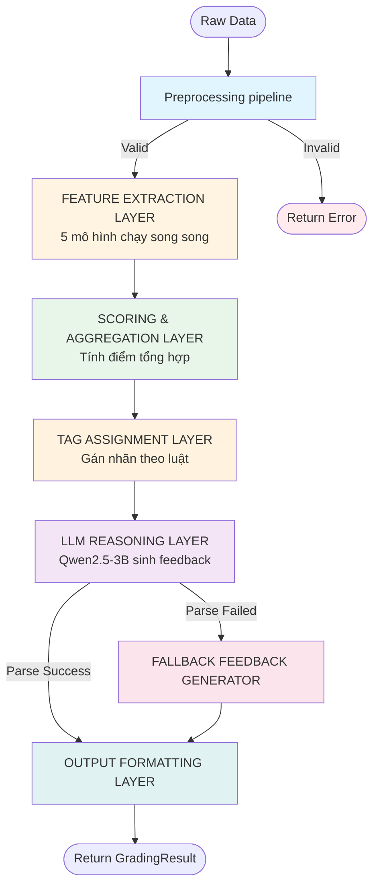
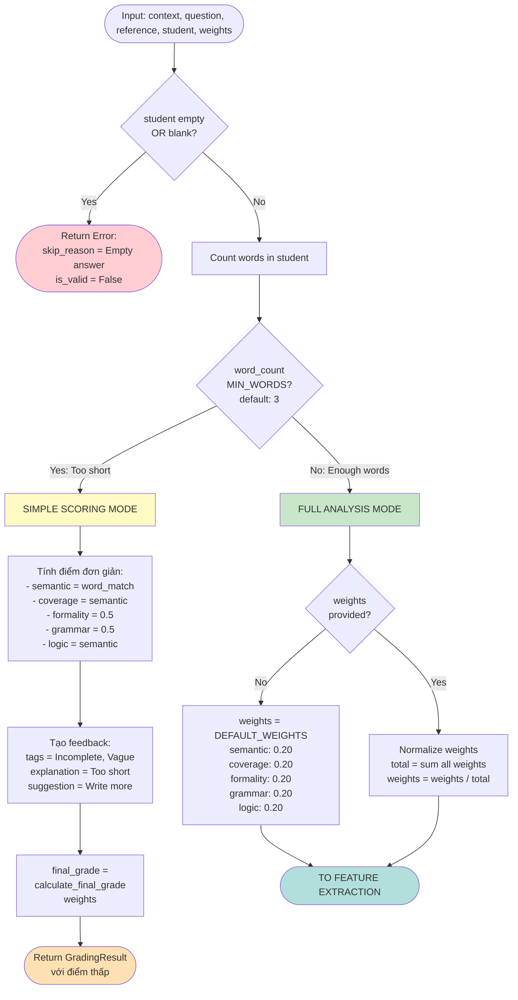
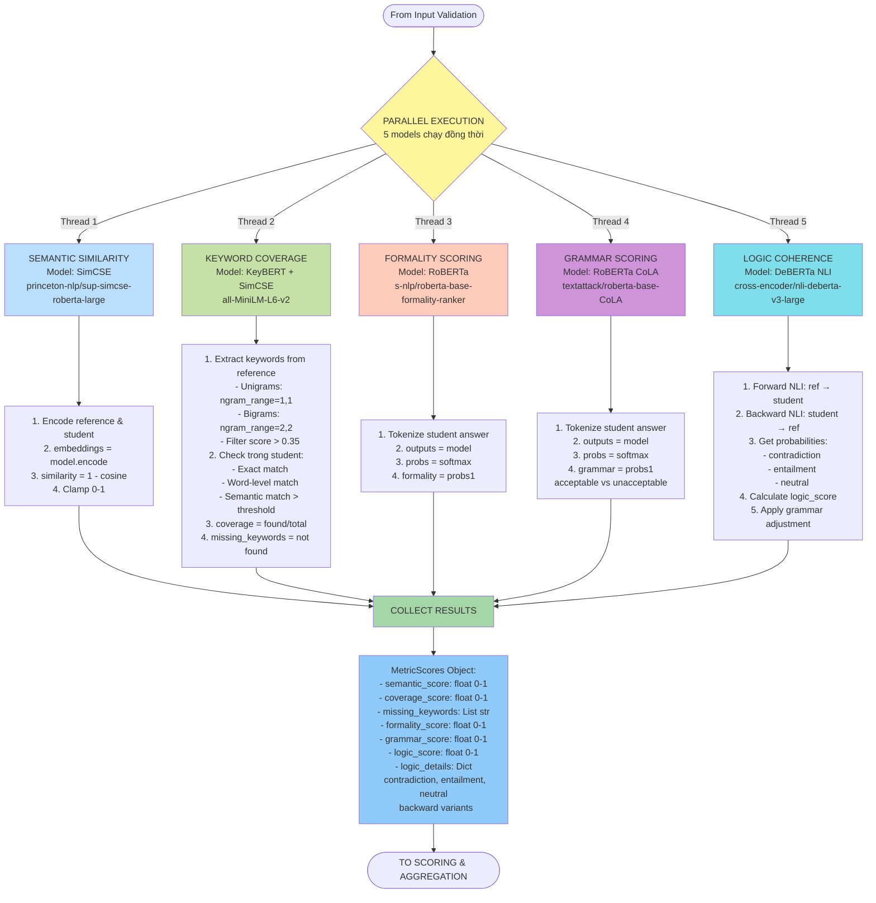
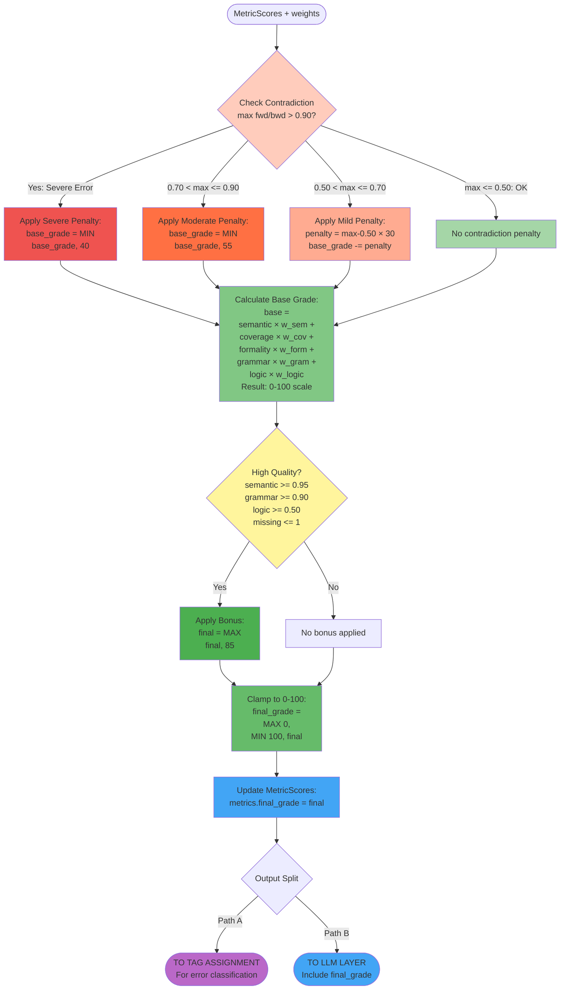
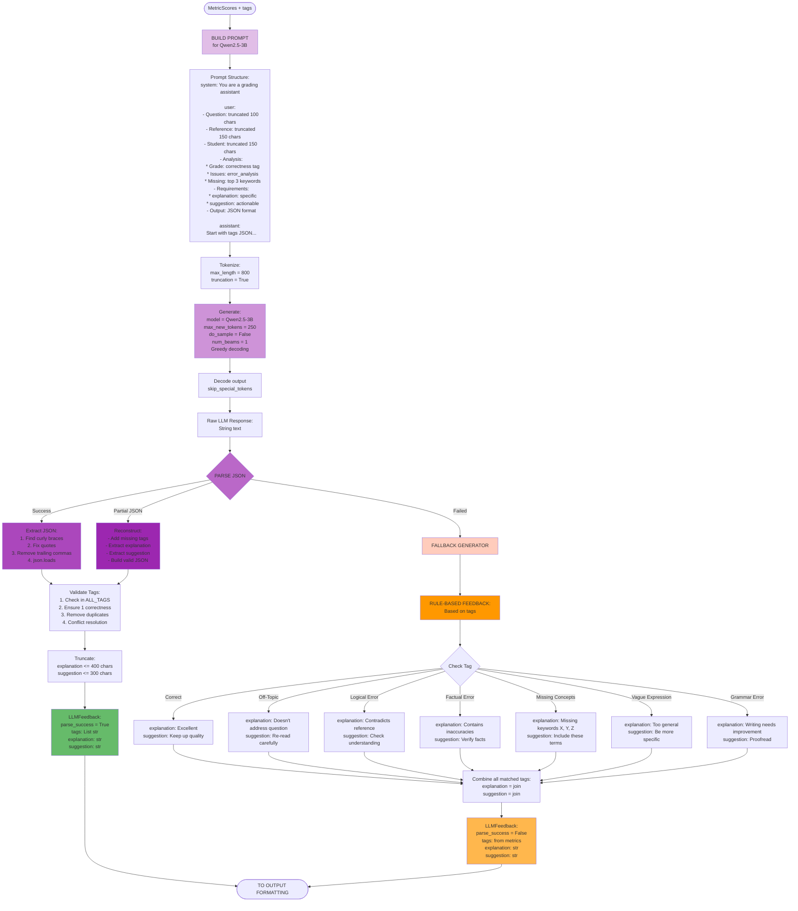

# HYBRID ASAG GRADING SYSTEM - DETAILED PIPELINE

## DANH SÁCH CÁC DIAGRAM

1. [**DIAGRAM 1: TỔNG QUAN HỆ THỐNG**](#diagram-1-tổng-quan-hệ-thống) - Luồng xử lý từ đầu đến cuối
2. [**DIAGRAM 2: INPUT VALIDATION LAYER**](#diagram-2-input-validation-layer) - Kiểm tra đầu vào
3. [**DIAGRAM 3: FEATURE EXTRACTION LAYER**](#diagram-3-feature-extraction-layer) - Trích xuất đặc trưng
4. [**DIAGRAM 4: SCORING & AGGREGATION LAYER**](#diagram-4-scoring--aggregation-layer) - Tính điểm và tổng hợp
5. [**DIAGRAM 5: TAG ASSIGNMENT LAYER**](#diagram-5-tag-assignment-layer) - Gán nhãn lỗi
6. [**DIAGRAM 6: LLM REASONING LAYER**](#diagram-6-llm-reasoning-layer) - Sinh feedback
7. [**DIAGRAM 7: OUTPUT FORMATTING LAYER**](#diagram-7-output-formatting-layer) - Format kết quả

---

## DIAGRAM 1: TỔNG QUAN HỆ THỐNG



**Mô tả:**
- **6 layers chính** xử lý tuần tự
- Layer 2 (Feature Extraction) chạy **5 models song song**
- Có **2 luồng output**: Parse success và Fallback
- Mỗi layer có điều kiện chuyển tiếp cụ thể

---

## DIAGRAM 2: INPUT VALIDATION LAYER



**Chi tiết:**
- **Điều kiện 1**: Empty check → Error return ngay lập tức
- **Điều kiện 2**: Word count < 3 → Simple mode (không chạy 5 models)
- **Điều kiện 3**: Word count >= 3 → Full analysis mode
- **Simple mode**: Chỉ tính word overlap, không dùng deep learning models
- **Full mode**: Validate và normalize weights → Chuyển sang Feature Extraction

---

## DIAGRAM 3: FEATURE EXTRACTION LAYER



**Chi tiết:**
- **Parallel execution**: 5 models chạy đồng thời để tối ưu thời gian
- **Model 1 - SimCSE**: Embedding-based cosine similarity
- **Model 2 - KeyBERT**: 
  - Extract keywords từ reference
  - 3 phương pháp match: exact, word-level, semantic
  - Trả về coverage score + missing keywords list
- **Model 3 - RoBERTa Formality**: Binary classification (formal vs informal)
- **Model 4 - RoBERTa CoLA**: Grammar acceptability score
- **Model 5 - DeBERTa NLI**: 
  - Bidirectional entailment check
  - Có grammar adjustment nếu grammar kém
- **Output**: MetricScores object với 6 scores + logic details

---

## DIAGRAM 4: SCORING & AGGREGATION LAYER



**Chi tiết điều kiện:**
1. **Contradiction Penalties** (Mutually exclusive):
   - `max_contradiction > 0.90` → Cap at 40
   - `0.70 < max <= 0.90` → Cap at 55
   - `0.50 < max <= 0.70` → Subtract penalty
   - `max <= 0.50` → No penalty

2. **Base Grade Calculation**:
   - Weighted sum: `Σ(score × weight) × 100`
   - All scores 0-1, weights sum to 1.0

3. **Bonus Condition** (ALL must be true):
   - `semantic >= 0.95` AND
   - `grammar >= 0.90` AND
   - `logic >= 0.50` AND
   - `missing_keywords <= 1`
   → Bonus: `final = max(final, 85)`

4. **Output Split** (Mũi tên 2 chiều explained):
   - **Path A**: MetricScores → Tag Assignment → LLM
   - **Path B**: MetricScores with final_grade → LLM (cho prompt)
   - Không phải 2 chiều, mà là **1 input → 2 destinations**

---

## DIAGRAM 5: TAG ASSIGNMENT LAYER

```mermaid
flowchart TD
    Start([MetricScores]) --> AdjustSemantic[ADJUST SEMANTIC SCORE<br/>based on contradiction]
    
    AdjustSemantic --> Check1{max_contradiction<br/>> 0.70?}
    
    Check1 -->|Yes: High| Adjust1[adjusted = <br/>semantic × 1 - max × 0.6]
    Check1 -->|0.50 < max <= 0.70| Adjust2[adjusted = <br/>semantic × 1 - max × 0.3]
    Check1 -->|No: max <= 0.50| NoAdjust[adjusted = semantic<br/>no change]
    
    Adjust1 --> CalcComposite
    Adjust2 --> CalcComposite
    NoAdjust --> CalcComposite[Calculate Composite:<br/>composite = <br/>  adjusted × 0.45 +<br/>  coverage × 0.20 +<br/>  logic × 0.20 +<br/>  grammar × 0.15]
    
    CalcComposite --> DetermineCorrectness[DETERMINE CORRECTNESS TAG<br/>Mutually Exclusive]
    
    DetermineCorrectness --> CheckCorrect{Condition Check}
    
    CheckCorrect -->|max_contradiction > 0.70| TagIncorrect[INCORRECT]
    
    CheckCorrect -->|adjusted >= 0.85<br/>logic >= 0.75<br/>max_contra <= 0.50<br/>grammar >= 0.70| TagCorrect[CORRECT]
    
    CheckCorrect -->|adjusted >= 0.85<br/>max_contra <= 0.50<br/>composite >= 0.65| TagCorrect2[CORRECT<br/>via composite]
    
    CheckCorrect -->|adjusted >= 0.70<br/>OR composite >= 0.45| TagPartial[PARTIALLY CORRECT]
    
    CheckCorrect -->|adjusted < 0.30| TagIncorrect2[INCORRECT<br/>off-topic]
    
    CheckCorrect -->|Other cases| TagPartial2[PARTIALLY CORRECT<br/>default]
    
    TagIncorrect --> tags1[tags = Incorrect]
    TagCorrect --> tags2[tags = Correct]
    TagCorrect2 --> tags2
    TagPartial --> tags3[tags = Partially Correct]
    TagPartial2 --> tags3
    TagIncorrect2 --> tags1
    
    tags2 --> CheckKeywords{Correct tag:<br/>Check keywords<br/>missing >= 2<br/>OR coverage < 0.50?}
    
    CheckKeywords -->|Yes: Downgrade| Downgrade[tags0 = Partially Correct<br/>Append: Missing Concepts]
    CheckKeywords -->|No| KeepCorrect[Keep: tags = Correct]
    
    KeepCorrect --> OutputCorrect([Return tags])
    
    Downgrade --> AddIssues
    tags1 --> AddIssues[ADD ISSUE TAGS<br/>Can have multiple]
    tags3 --> AddIssues
    
    AddIssues --> CheckOffTopic{semantic < 0.30?}
    CheckOffTopic -->|Yes| AddOffTopic[Append: Off-Topic]
    CheckOffTopic -->|No| SkipOffTopic
    
    AddOffTopic --> CheckLogicalError
    SkipOffTopic --> CheckLogicalError{max_contradiction<br/>> 0.70?}
    
    CheckLogicalError -->|Yes| AddLogical[Append: Logical Error<br/>IF semantic >= 0.30:<br/>  Also add Factual Error]
    CheckLogicalError -->|logic < 0.40<br/>AND not grammar issue| AddFactual[Append: Factual Error]
    CheckLogicalError -->|No| SkipLogical
    
    AddLogical --> CheckMissing
    AddFactual --> CheckMissing
    SkipLogical --> CheckMissing{missing_keywords<br/>AND coverage < 0.60<br/>OR len missing >= 2?}
    
    CheckMissing -->|Yes| AddMissing[Append: Missing Concepts<br/>if not already added]
    CheckMissing -->|No| CheckVague
    
    AddMissing --> CheckVague{adjusted >= 0.70<br/>coverage < 0.70<br/>no Missing/Grammar tags<br/>no missing keywords?}
    
    CheckVague -->|Yes| AddVague[Append: Vague Expression]
    CheckVague -->|No| CheckGrammar
    
    AddVague --> CheckGrammar{grammar < 0.70?}
    
    CheckGrammar -->|Yes| AddGrammar[Append: Grammar Error]
    CheckGrammar -->|No| Done
    
    AddGrammar --> Done[DONE: Return tags array]
    Done --> OutputIssue([Return tags:<br/>Correctness + Issues])
    
    style TagIncorrect fill:#ef5350
    style TagCorrect fill:#66bb6a
    style TagCorrect2 fill:#66bb6a
    style TagPartial fill:#ffb74d
    style TagPartial2 fill:#ffb74d
    style TagIncorrect2 fill:#ef5350
    style AddOffTopic fill:#ff7043
    style AddLogical fill:#e57373
    style AddFactual fill:#ef5350
    style AddMissing fill:#ffb74d
    style AddVague fill:#ffd54f
    style AddGrammar fill:#ba68c8
    style OutputCorrect fill:#4caf50
    style OutputIssue fill:#42a5f5
```



**Quy tắc gán tag:**

### **CORRECTNESS TAG** (Chọn 1):
| Điều kiện | Tag | Priority |
|-----------|-----|----------|
| `max_contradiction > 0.70` | **Incorrect** | 1 (highest) |
| `adjusted >= 0.85` AND `logic >= 0.75` AND `max_contra <= 0.50` AND `grammar >= 0.70` | **Correct** | 2 |
| `adjusted >= 0.85` AND `max_contra <= 0.50` AND `composite >= 0.65` | **Correct** | 2 |
| `adjusted >= 0.70` OR `composite >= 0.45` | **Partially Correct** | 3 |
| `adjusted < 0.30` | **Incorrect** (off-topic) | 1 |
| Default | **Partially Correct** | 3 |

### **ISSUE TAGS** (Có thể nhiều):
| Điều kiện | Tag | Check Order |
|-----------|-----|-------------|
| `semantic < 0.30` | Off-Topic | 1 |
| `max_contradiction > 0.70` | Logical Error | 2 |
| `max_contradiction > 0.70` AND `semantic >= 0.30` | Factual Error | 2 |
| `logic < 0.40` AND not grammar issue | Factual Error | 2 |
| `missing_keywords` AND (`coverage < 0.60` OR `len >= 2`) | Missing Concepts | 3 |
| `adjusted >= 0.70` AND `coverage < 0.70` AND no other issues | Vague Expression | 4 |
| `grammar < 0.70` | Grammar Error | 5 |

### **Special Case - Downgrade Correct**:
- Nếu tag = "Correct" nhưng `missing >= 2` OR `coverage < 0.50`
- → Downgrade to "Partially Correct" + add "Missing Concepts"

---

## DIAGRAM 6: LLM REASONING LAYER



**Chi tiết:**

### **Prompt Template**:
```
<|im_start|>system
You are a grading assistant. Provide specific, actionable feedback. Output ONLY valid JSON.
<|im_end|>
<|im_start|>user
Grade this student answer with SPECIFIC feedback.

Question: "{question[:100]}"
Reference Answer: "{reference[:150]}"
Student Answer: "{student[:150]}"

Analysis:
- Grade: {correctness}
- Issues: {error_analysis}
- Missing Keywords: {missing_list}

Requirements for your response:
1. explanation: Explain what is wrong or right, referencing specific parts of the student's answer
2. suggestion: Give SPECIFIC advice on how to improve, including what words/concepts to add or correct

Output JSON:
{"tags": [...], "explanation": "specific explanation", "suggestion": "specific improvement"}
<|im_end|>
<|im_start|>assistant
{"tags": [...], "explanation": "
```

### **Parse Strategies** (Thứ tự thử):
1. **Direct JSON parse**: `json.loads(response)`
2. **Extract & clean**: Find `{...}`, fix quotes, remove commas
3. **Reconstruct**: Add missing parts from metrics
4. **Fallback**: Rule-based generation

### **Fallback Rules**:
- Dựa trên tags từ Tag Assignment Layer
- Mỗi tag có template explanation + suggestion cố định
- Combine multiple tags → Join strings
- Luôn có `parse_success = False` marker

---

## DIAGRAM 7: OUTPUT FORMATTING LAYER

```mermaid
flowchart TD
    Start([MetricScores + LLMFeedback]) --> CreateResult[Create GradingResult object]
    
    CreateResult --> PopulateMetrics[Populate metrics:<br/>- semantic_score<br/>- coverage_score<br/>- missing_keywords<br/>- formality_score<br/>- grammar_score<br/>- logic_score<br/>- logic_details<br/>- final_grade]
    
    PopulateMetrics --> PopulateFeedback[Populate feedback:<br/>- tags<br/>- explanation<br/>- suggestion<br/>- parse_success<br/>- raw_response]
    
    PopulateFeedback --> SetValid[Set validity:<br/>is_valid = True<br/>skip_reason = null]
    
    SetValid --> Format{Output Format}
    
    Format -->|API JSON| FormatJSON[Convert to JSON:<br/>result.to_dict]
    
    Format -->|Python Object| FormatObject[Return GradingResult:<br/>dataclass object]
    
    FormatJSON --> JSONStructure[JSON Structure:<br/>metrics:<br/>  semantic_score: float<br/>  coverage_score: float<br/>  missing_keywords: str array<br/>  formality_score: float<br/>  grammar_score: float<br/>  logic_score: float<br/>  logic_details:<br/>    contradiction: float<br/>    entailment: float<br/>    neutral: float<br/>    backward_*: float<br/>  final_grade: float<br/>feedback:<br/>  tags: str array<br/>  explanation: str<br/>  suggestion: str<br/>  parse_success: bool<br/>is_valid: bool<br/>skip_reason: str or null]
    
    FormatObject --> ObjectStructure[GradingResult:<br/>@dataclass<br/>- metrics: MetricScores<br/>- feedback: LLMFeedback<br/>- is_valid: bool<br/>- skip_reason: Optional str]
    
    JSONStructure --> Return1([Return JSON Response<br/>Status 200])
    ObjectStructure --> Return2([Return Python Object])
    
    Return1 --> End([Client/Frontend])
    Return2 --> End
    
    style CreateResult fill:#90caf9
    style PopulateMetrics fill:#81c784
    style PopulateFeedback fill:#ce93d8
    style SetValid fill:#66bb6a
    style FormatJSON fill:#42a5f5
    style FormatObject fill:#5c6bc0
    style JSONStructure fill:#29b6f6
    style ObjectStructure fill:#7e57c2
    style End fill:#4caf50
```

**Output Format Details:**

### **API Response JSON**:
```json
{
  "metrics": {
    "semantic_score": 0.85,
    "coverage_score": 0.75,
    "missing_keywords": ["chlorophyll", "glucose"],
    "formality_score": 0.80,
    "grammar_score": 0.90,
    "logic_score": 0.70,
    "logic_details": {
      "contradiction": 0.05,
      "entailment": 0.82,
      "neutral": 0.13,
      "backward_entailment": 0.75,
      "backward_contradiction": 0.08,
      "backward_neutral": 0.17
    },
    "final_grade": 78.5
  },
  "feedback": {
    "tags": ["Partially Correct", "Missing Concepts"],
    "explanation": "Your answer correctly identifies the role of sunlight and water in photosynthesis. However, it misses key concepts like chlorophyll and glucose production.",
    "suggestion": "Include these important terms: 'chlorophyll, glucose'. Explain how chlorophyll captures sunlight and how glucose is produced.",
    "parse_success": true
  },
  "is_valid": true,
  "skip_reason": null
}
```

### **Error Case**:
```json
{
  "metrics": null,
  "feedback": null,
  "is_valid": false,
  "skip_reason": "Empty student answer"
}
```

---

## TÓM TẮT LUỒNG XỬ LÝ

### **LUỒNG CHÍNH (Happy Path)**:
```
Input → Validation ✓ 
  → Feature Extraction (5 models ||)
  → Scoring (weighted sum + penalties/bonuses)
  → Tag Assignment (rules-based)
  → LLM Reasoning (Qwen2.5-3B)
  → Parse Success ✓
  → Output Formatting
  → Return JSON
```

### **LUỒNG LỖI 1: Empty Input**:
```
Input → Validation ✗ (empty)
  → Return Error: skip_reason = "Empty answer"
```

### **LUỒNG LỖI 2: Short Answer**:
```
Input → Validation (word_count < 3)
  → Simple Scoring (word overlap only)
  → Simple Feedback (Incomplete tag)
  → Return Low Grade
```

### **LUỒNG DỰ PHÒNG: Parse Failed**:
```
Input → ... → LLM Reasoning
  → Parse Failed ✗
  → Fallback Generator (rule-based)
  → Output Formatting
  → Return JSON (parse_success = false)
```

### **CÁC ĐIỂM SONG SONG**:
1. **Feature Extraction**: 5 models chạy đồng thời
2. **Scoring Output**: 1 object → 2 destinations (Tag + LLM)

### **CÁC ĐIỂM ĐIỀU KIỆN**:
1. **Validation**: empty, word_count, weights
2. **Scoring**: contradiction levels (3 thresholds), bonus check
3. **Tagging**: correctness (6 conditions), issues (6 types)
4. **LLM**: parse success/fail

### **MODELS ĐƯỢC SỬ DỤNG**:
1. **SimCSE** (`princeton-nlp/sup-simcse-roberta-large`) - Semantic
2. **KeyBERT** (`all-MiniLM-L6-v2`) - Coverage
3. **RoBERTa Formality** (`s-nlp/roberta-base-formality-ranker`) - Formality
4. **RoBERTa CoLA** (`textattack/roberta-base-CoLA`) - Grammar
5. **DeBERTa NLI** (`cross-encoder/nli-deberta-v3-large`) - Logic
6. **Qwen2.5-3B-Instruct** - Reasoning & Feedback

### **THRESHOLD VALUES**:
```python
THRESHOLDS = {
    "semantic_correct": 0.85,
    "semantic_partial": 0.70,
    "semantic_off_topic": 0.30,
    "coverage_correct": 0.80,
    "coverage_good": 0.70,
    "coverage_missing": 0.60,
    "grammar_good": 0.70,
    "logic_correct": 0.75,
    "logic_error": 0.40,
    "contradiction_high": 0.70,
    "contradiction_moderate": 0.50
}
```

### **WEIGHT CONFIGURATIONS**:
```python
DEFAULT_WEIGHTS = {
    "semantic": 0.20,
    "coverage": 0.20,
    "formality": 0.20,
    "grammar": 0.20,
    "logic": 0.20
}
```

---

## PHỤ LỤC: MÃ HÓA LUỒNG XỬ LÝ

### **Pseudo-code tổng quát**:
```python
def grade_answer(context, question, reference, student, weights):
    # LAYER 1: INPUT VALIDATION
    if student.empty():
        return Error("Empty answer")
    
    if len(student.split()) < MIN_WORDS:
        return simple_grade(student, reference)
    
    weights = normalize_weights(weights or DEFAULT_WEIGHTS)
    
    # LAYER 2: FEATURE EXTRACTION (Parallel)
    with ThreadPool(5) as pool:
        semantic = pool.submit(get_semantic_score, reference, student)
        coverage, missing = pool.submit(get_keyword_coverage, question, reference, student)
        formality = pool.submit(get_formality_score, student)
        grammar = pool.submit(get_grammar_score, student)
        logic, logic_details = pool.submit(get_logic_score, reference, student, grammar)
    
    metrics = MetricScores(
        semantic.result(), coverage.result(), missing.result(),
        formality.result(), grammar.result(), logic.result(), logic_details.result()
    )
    
    # LAYER 3: SCORING & AGGREGATION
    base_grade = weighted_sum(metrics, weights)
    
    if max_contradiction(metrics) > 0.90:
        base_grade = min(base_grade, 40)
    elif max_contradiction(metrics) > 0.70:
        base_grade = min(base_grade, 55)
    elif max_contradiction(metrics) > 0.50:
        base_grade -= penalty(max_contradiction)
    
    if high_quality(metrics):
        base_grade = max(base_grade, 85)
    
    metrics.final_grade = clamp(base_grade, 0, 100)
    
    # LAYER 4: TAG ASSIGNMENT
    tags = assign_tags(metrics)
    
    # LAYER 5: LLM REASONING
    prompt = build_prompt(context, question, reference, student, metrics, tags)
    llm_response = qwen_generate(prompt)
    
    try:
        feedback = parse_json(llm_response)
        feedback.tags = validate_tags(feedback.tags, metrics)
    except:
        feedback = fallback_feedback(tags, metrics)
    
    # LAYER 6: OUTPUT FORMATTING
    result = GradingResult(metrics, feedback, is_valid=True)
    return result.to_json()
```

---

**END OF DETAILED PIPELINE DIAGRAMS**
